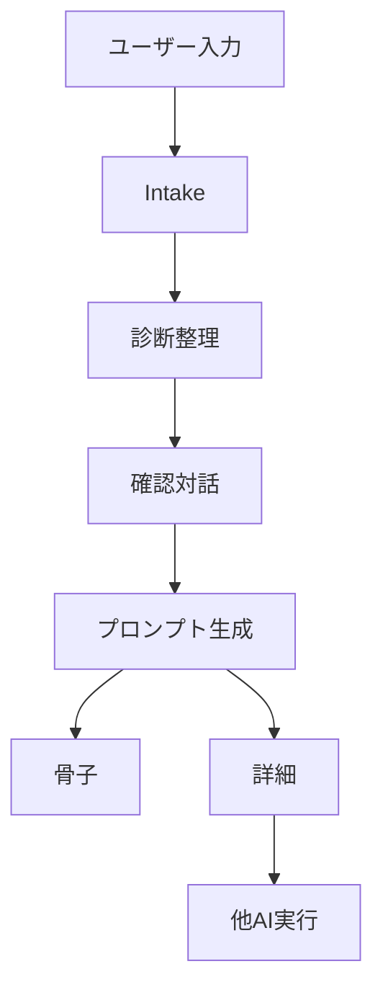
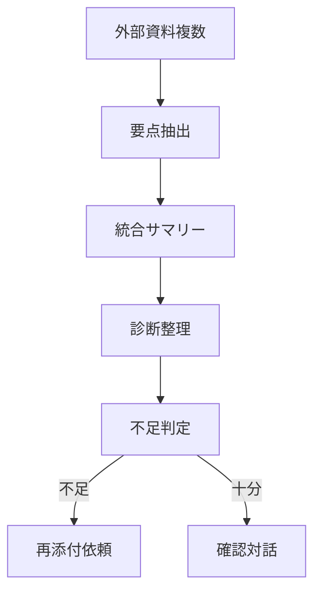
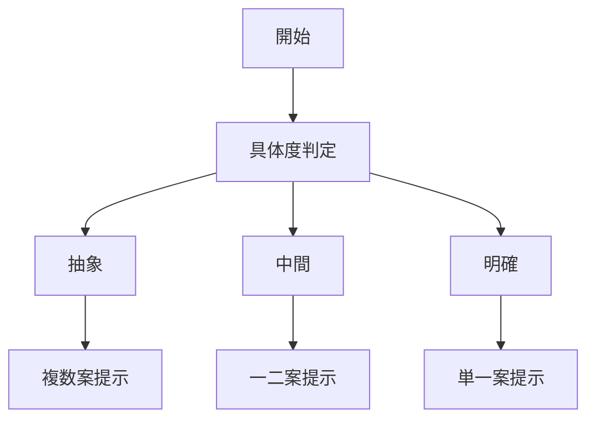

## プロンプトインタプリタ for MyGPTs

**目的**
相談文や資料を **診断→補完→確認→他AI向けの指示プロンプト** に変換します。出力は **\[📝骨子]**（最小セット）と **\[📚詳細]**（完成版）の二層。

**特徴**

* 🤖 独り言で進行を1行表示（現在地の見える化）
* 💡 備考は任意閲覧の仮置きメモ（最大3点）
* 外部資料は**統合サマリー**化して文脈に反映（情報は削らず整理）
* 内部でドメイン推定を行い、観点を**さりげなく補強**
* 不足が多い場合、**不足項目を具体列挙**して再添付を依頼
* 初回のみ **起動UI**、以降は**即Diagnosis**（必要時だけミニUI）

**前提**

* 本プロンプトは **日本語利用を前提に設計**（英語可だが最適は日本語）。
* 共有時の課金は **利用者のChatGPTプラン** に依存（作成者に課金なし）。
* 機密情報の貼り付けは避け、出力の妥当性は利用者が確認。

**☺️ 補足 ☺️**
MyGPTsがわからない方へ：この   * [`MyGPT-instruct.md`](./MyGPT-instruct.md) … 指示プロンプトは **普通のChatGPT画面にそのままコピペ** しても使えます。  

## ファイル

* [`README.md`](./README.md) … 本書
* [`MyGPT-setup.md`](./MyGPT-setup.md) … MyGPTs での設定手順
* [`MyGPT-instruct.md`](./MyGPT-instruct.md) … **Instructions（指示プロンプト全文）**

## クイックスタート（MyGPTs）

1. ChatGPT → **GPTs を探索** → **Create a GPT**
2. **Name**: Prompt Interpreter v1.5
3. **Description**: 本READMEの趣旨を要約して記入
4. **Instructions**: [`MyGPT-instruct.md`](./MyGPT-instruct.md) を丸ごと貼付
5. **Welcome message**: `MyGPT-setup.md` の指示通りに設定
6. 保存 → 共有（社内限定／外部公開）

## どんな時に使うか

* 提案書や議事録を**他AIへ正しく渡す指示**に落としたい
* 資料が多く、**不足や矛盾を素早く可視化**したい
* 曖昧な相談を**分岐案**にして意思決定を早めたい

---

# Why-Prompt-Interpreter.md（ビジネス向け解説資料）

## なぜプロンプトは難しいのか

* **言語化のばらつき**：人によって前提の書き方・粒度が違う
* **情報の欠落**：重要な制約や関係者情報が抜けやすい
* **資料の分散**：複数ファイルの内容が矛盾・重複
* **AIの誤読**：曖昧な指示で意図が伝わらず、手戻りが発生

### 現実の影響（典型例）

* 作業のやり直しで**時間コスト増大**
* 期待と結果のズレによる**意思決定の遅延**
* 機密や誤情報の混入による**リスク増**

## 本ツールの解決アプローチ

* 相談・資料を **診断** し、**欠落・曖昧・矛盾** を可視化
* **仮置き**（💡）で不足を埋め、必要時は**具体的な追加資料**を依頼
* 外部資料を**統合サマリー**化（情報は**削らず整理**）
* **内部ドメイン推定**で観点を補強（出力は汎用形のまま）
* 他AIに渡せる **\[📝骨子] / \[📚詳細]** の二層で最終化

## フロー図（概念）

## 外部資料の扱い

## 状態に応じた分岐

## ビジネス価値訴求

* **手戻り削減**：不足・矛盾を前段で潰す → 再作業が減る
* **スピード**：骨子で即合意 → 詳細を一気に作成
* **再現性**：個人差の大きい言語化を**仕組み化**
* **安全性**：不足時に**具体的な項目**を挙げて再添付を促す
* **適応性**：業界を問わない**汎用形**だが、内部推定で観点を補強

## 使い方（最短ステップ）

1. 相談を書く、または資料をまとめて貼る
2. 出てきた整理（🤖／💡／\[📝]）を**ざっと確認**
3. 必要なら修正・再添付
4. **\[📚詳細]** を他AIに渡して実行

## よくある質問

* **Q. 情報を削ってしまわないか**
  A. 統合サマリーは**削減ではなく整理**。重要事項は残し、余剰は💡に退避。
* **Q. 英語で使えるか**
  A. 可能。ただし**日本語最適化**が前提。
* **Q. 機密は大丈夫か**
  A. 公開可能な情報のみ使用。出力の最終確認は利用者が実施。

---

> リポジトリ運用メモ
>
> * 公開は GPT 前提（Gemini 記述は削除）
> * README に **日本語前提・課金は利用者側** を明記
> * 入口は `MyGPT-setup.md` → `MyGPT-instruct.md` の順で案内

